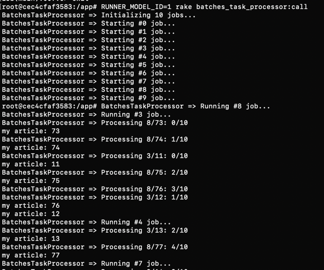

# BatchesTaskProcessor
Gem that allows to process huge amount of any kind of tasks in parallel using batches.

## Installation
Add this line to your application's Gemfile:

```ruby
gem "batches_task_processor"
```
And then execute: `bundle install`


## Usage 
- Register a new task: 
  ```ruby
  task = BatchesTaskProcessor::Model.create!(
    key: 'my_process',
    data: [1, 2, 3],
    qty_jobs: 10,
    process_item: 'puts "my item: #{item}"'
  )
  ```
  Activerecord sample (recommended `preload_job_items` for performance reasons):
  ```ruby
  task = BatchesTaskProcessor::Model.create!(
    key: 'my_process',
    data: Article.all.pluck(:id),
    qty_jobs: 10,
    preload_job_items: 'Article.where(id: items)',
    process_item: 'puts "my article: #{item.id}"'
  )
  ```
  
- Run the corresponding rake task:     
  Copy the `task.id` from step one and use it in the following code:    
  `RUNNER_MODEL_ID=<id-here> rake batches_task_processor:call`
  


## TODO
- update tests

## Api
Settings:    
- `data` (Array<Integer|String>) Array of whole items to be processed.
- `key` (Mandatory) key to be used to identify the task.
- `qty_jobs` (Optional) number of jobs to be created. Default: `10`
- `process_item` (Mandatory) callback to be called to perform each item where `item` variable holds the current item value. Sample: `'Article.find(item).update_column(:title, "changed")'`
- `preload_job_items` (Optional) callback that allows to preload items list and/or associations where `items` variable holds the current chunk of items to be processed (by default returns the same list). Sample: `Article.where(id: items)`

Tasks (requires `RUNNER_MODEL_ID` env variable):    
- `rake batches_task_processor:call` Starts the processing of jobs (Skips already processed ones when rerunning after cancel).
- `rake batches_task_processor:status` Prints the process status.
- `rake batches_task_processor:cancel` Marks as cancelled the process and stops processing jobs (Change into `pending` to rerun again).

## Contributing
Contribution directions go here.

## License
The gem is available as open source under the terms of the [MIT License](https://opensource.org/licenses/MIT).
